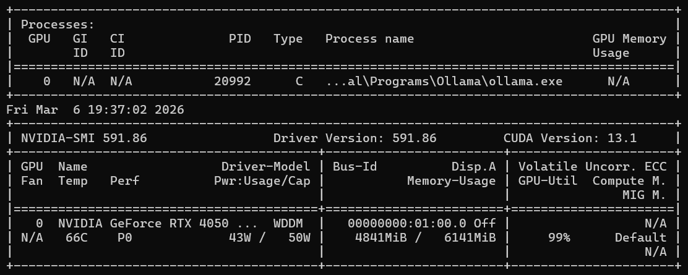

# Offline LLM Benchmark & Structured Generation Framework

A framework for evaluating small **local language models** on structured generation tasks with schema validation and automatic retry mechanisms.

This project explores how reliably small LLMs running locally can produce **valid structured outputs** when constrained by schemas. The system benchmarks multiple models and analyzes their performance across structured tasks.

---

## Project Motivation

Large language models accessed through APIs are powerful but often expensive and dependent on cloud infrastructure.

Running **small language models locally** provides advantages such as:

* Data privacy
* Offline capability
* Lower operational cost
* Full control over inference pipelines

However, small models frequently struggle with **structured output generation**.
This project investigates how well local models perform when generating structured data under strict constraints.

---

## Project Objectives

* Evaluate multiple local LLMs on structured generation tasks
* Enforce JSON schema outputs
* Validate model responses automatically
* Implement retry mechanisms for invalid outputs
* Benchmark performance across models
* Generate evaluation reports for analysis

---

### Directory Overview

**benchmark/**
Contains scripts for running inference on different models and collecting performance metrics.

**structured_generation/**
Implements schema definitions, validation logic, and retry mechanisms for enforcing structured outputs.

**evaluation/**
Stores test prompts and scripts used to compare model outputs.

**results/**
Stores benchmark outputs, metrics, and analysis reports.

---

# Project Phases

### Phase 1 — Local LLM Benchmarking (Completed)

Run multiple small language models locally and measure inference performance.

Tasks completed:

* Built benchmarking pipeline
* Measured **Time to First Token**
* Measured **Tokens per second**
* Measured **Total response latency**
* Compared **CPU vs GPU inference performance**

---

### Phase 2 — Structured Output Generation (Upcoming)

* Define JSON schemas
* Enforce schema-constrained responses
* Implement structured prompts

---

### Phase 3 — Validation & Retry Mechanism (Upcoming)

* Detect invalid model outputs
* Validate responses using schema validation
* Retry generation automatically

---

### Phase 4 — Model Evaluation

* Run structured prompts across models
* Measure success rate of valid outputs

---

### Phase 5 — Result Analysis

* Aggregate metrics
* Generate structured output reliability reports

---

# Phase 1 — Benchmarking Results

This phase measures the **inference performance of local LLMs**.

### Metrics Collected

* Time to First Token (TTFT)
* Tokens generated per second
* Average latency
* Average tokens generated

---

# Models Benchmarked

| Model       | Approx Size |
| ----------- | ----------- |
| llama3.2:1b | 1B          |
| phi3        | ~3B         |
| mistral     | ~7B         |
| llama3.1:8b | 8B          |

---

# Hardware Used

GPU: NVIDIA RTX 4050 Laptop GPU
VRAM: 6GB
CUDA Version: 13.1

---

# CPU vs GPU Benchmark Results

| Model       | TTFT CPU (s) | TTFT GPU (s) | Tokens/sec CPU | Tokens/sec GPU | Latency CPU (s) | Latency GPU (s) |
| ----------- | ------------ | ------------ | -------------- | -------------- | --------------- | --------------- |
| llama3.2:1b | 0.381        | 0.410        | 124.77         | 124.52         | 3.889           | 3.777           |
| phi3        | 0.250        | 0.252        | 70.89          | 69.97          | 4.166           | 4.531           |
| mistral     | 0.308        | 0.298        | 37.75          | 36.90          | 8.862           | 9.073           |
| llama3.1:8b | 0.561        | 0.549        | 24.90          | 25.16          | 20.549          | 20.313          |

---

### Key Observations

- Small models like **llama3.2:1b** and **phi3** show minimal difference between CPU and GPU.
- Larger models like **llama3.1:8b** benefit slightly more from GPU acceleration.
- Overall throughput is influenced more by **model size** than by hardware in this benchmark.
- For lightweight local assistants, **1B–3B models are very efficient even on CPU**.

---

# Performance Insights

From the benchmarking results we observe:

1. Inference throughput scales inversely with model size.
2. Smaller models (1B–3B parameters) provide excellent latency and responsiveness.
3. GPU acceleration provides limited benefits for very small models due to CPU memory bandwidth already being sufficient.
4. Larger models (7B–8B) begin to show measurable GPU advantage.

These insights are important when designing **local AI assistants**, where low latency and efficient resource usage are critical.

---

# GPU Inference Verification

GPU inference was verified using:

nvidia-smi -l 1

While running models, GPU utilization increased and VRAM allocation rose significantly, confirming GPU-accelerated inference.

Example:



---

# Project Architecture

```
local-llm-benchmark/

benchmark/
    benchmark_models.py
    result_analysis.py

structured_generation/
    schema.py
    validator.py
    retry_logic.py

evaluation/
    test_prompts.json
    compare_models.py

results/
    benchmark_results_cpu.csv
    benchmark_results_gpu.csv
```

---

# Planned Tech Stack

* Python
* Ollama (Local LLM Runtime)
* Pydantic
* Pandas
* Matplotlib
* JSON Schema Validation

---

# Running the Benchmark

1. Install Ollama

https://ollama.com/

2. Pull required models

ollama pull llama3.2:1b  
ollama pull phi3  
ollama pull mistral  
ollama pull llama3.1:8b  

3. Run the benchmark

python benchmark/benchmark_models.py

4. Results will be saved in

results/benchmark_results_cpu.csv  
results/benchmark_results_gpu.csv

---

## Documentation

Detailed technical documentation is available in the `docs/` directory.

- Phase 1 Benchmarking Details → docs/phase1_benchmarking.md
- System Architecture → docs/system_design.md
- Structured Generation Design → docs/structured_generation_design.md

---

# Future Improvements

* Support additional local models
* Add visualization dashboards for evaluation results
* Extend structured benchmarking datasets
* Evaluate reliability improvements using retry mechanisms

---

# Author

Divya Thakran

---

# Project Status

Phase 1 completed
Phase 2 implementation in progress
