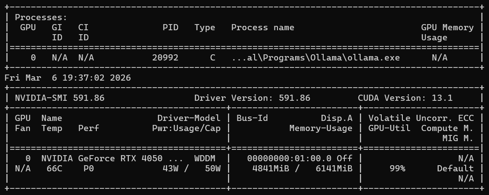
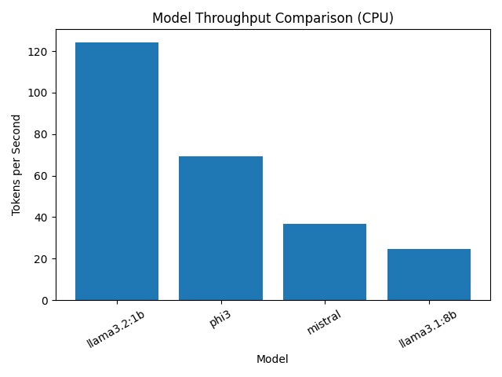
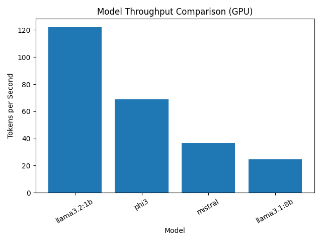
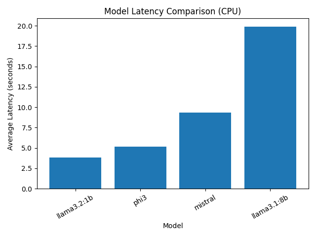
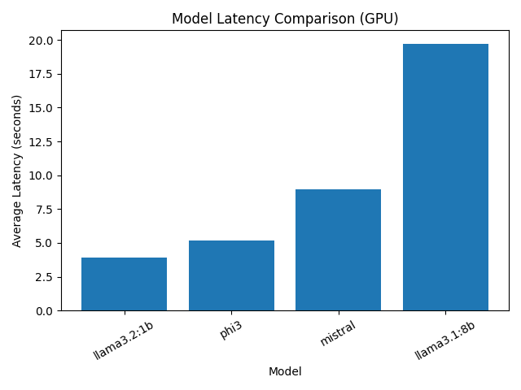

# Offline LLM Benchmark & Structured Generation Framework

A framework for benchmarking **local language models** on inference performance and structured generation reliability.

This project evaluates how efficiently small LLMs run locally and how reliably they produce **schema-constrained JSON outputs**. The system benchmarks multiple models across hardware configurations and structured generation tasks.

---

## Project Motivation

Large language models accessed through APIs are powerful but often expensive and dependent on cloud infrastructure.

Running **small language models locally** provides advantages such as:

* Data privacy
* Offline capability
* Lower operational cost
* Full control over inference pipelines

However, small models frequently struggle with **structured output generation**.
This project investigates how well local models perform when generating structured data under strict constraints.

---

## Project Objectives

* Benchmark inference performance of local LLMs
* Measure tokens/sec, latency, and time-to-first-token
* Compare CPU vs GPU inference performance
* Enforce JSON schema outputs for structured generation
* Validate model responses using Pydantic
* Implement retry mechanisms for invalid outputs
* Evaluate reliability of structured generation across models

---

### Directory Overview

**benchmark/**
Contains scripts for running inference on different models and collecting performance metrics.

**structured_generation/**
Implements schema definitions, validation logic, and retry mechanisms for enforcing structured outputs.

**evaluation/**
Stores test prompts and scripts used to compare model outputs.

**results/**
Stores benchmark outputs, metrics, and analysis reports.

---

# Project Phases

### Phase 1 — Local LLM Benchmarking (Completed)

Run multiple small language models locally and measure inference performance.

Tasks completed:

* Built benchmarking pipeline
* Measured **Time to First Token**
* Measured **Tokens per second**
* Measured **Total response latency**
* Compared **CPU vs GPU inference performance**

---

### Phase 2 — Structured Output Generation (Completed)

This phase introduces schema-constrained generation to evaluate how reliably local language models can produce valid structured outputs.

Key components implemented:

* JSON schema definition for structured responses
* Structured prompt templates enforcing JSON output
* Automatic validation using **Pydantic**
* Retry mechanism for invalid model outputs
* Reliability benchmarking across models
* Temperature-based evaluation to analyze stochastic behavior

---

### Phase 3 — Structured Output Reliability Evaluation (Completed)

This phase evaluates how reliably local language models generate valid JSON outputs under schema constraints.

Tasks completed:

* Ran structured prompts across multiple models
* Tested outputs under different temperature settings
* Validated responses using Pydantic schemas
* Implemented automatic retry for invalid outputs
* Measured JSON output success rate across models

---

# Phase 1 — Benchmarking Results

This phase measures the **inference performance of local LLMs**.

### Metrics Collected

* Time to First Token (TTFT)
* Tokens generated per second
* Average latency
* Average tokens generated

---

# Models Benchmarked

| Model       | Approx Size |
| ----------- | ----------- |
| llama3.2:1b | 1B          |
| phi3        | ~3B         |
| mistral     | ~7B         |
| llama3.1:8b | 8B          |

---

# Hardware Used

GPU: NVIDIA RTX 4050 Laptop GPU
VRAM: 6GB
CUDA Version: 12.x

---

# CPU vs GPU Benchmark Results

| Model       | TTFT CPU (s) | TTFT GPU (s) | Tokens/sec CPU | Tokens/sec GPU | Latency CPU (s) | Latency GPU (s) |
| ----------- | ------------ | ------------ | -------------- | -------------- | --------------- | --------------- |
| llama3.2:1b | 0.381        | 0.410        | 124.77         | 124.52         | 3.889           | 3.777           |
| phi3        | 0.250        | 0.252        | 70.89          | 69.97          | 4.166           | 4.531           |
| mistral     | 0.308        | 0.298        | 37.75          | 36.90          | 8.862           | 9.073           |
| llama3.1:8b | 0.561        | 0.549        | 24.90          | 25.16          | 20.549          | 20.313          |

---

### Key Observations

- Small models like **llama3.2:1b** and **phi3** show minimal difference between CPU and GPU.
- Larger models like **llama3.1:8b** benefit slightly more from GPU acceleration.
- Overall throughput is influenced more by **model size** than by hardware in this benchmark.
- For lightweight local assistants, **1B–3B models are very efficient even on CPU**.

---

# Performance Insights

From the benchmarking results we observe:

1. Inference throughput scales inversely with model size.
2. Smaller models (1B–3B parameters) provide excellent latency and responsiveness.
3. GPU acceleration provides limited benefits for very small models due to CPU memory bandwidth already being sufficient.
4. Larger models (7B–8B) begin to show measurable GPU advantage.

These insights are important when designing **local AI assistants**, where low latency and efficient resource usage are critical.

---

# GPU Inference Verification

GPU inference was verified using:

nvidia-smi -l 1

While running models, GPU utilization increased and VRAM allocation rose significantly, confirming GPU-accelerated inference.

Example:



---

# Phase 2 — Structured Output Reliability Benchmark

This phase evaluates how reliably local language models can generate **valid JSON outputs** under schema constraints.

Each model was tested using:

* 30 structured prompts
* 2 temperature settings (0 and 0.7)
* Total generations per model: **60**

All responses were validated using **Pydantic schema validation**, and invalid outputs were automatically retried once.

---

## JSON Structured Output Success Rate

| Model | Temp 0 Success | Temp 0.7 Success | Total Success | Success Rate |
|------|------|------|------|------|
| llama3.2:1b | 25 / 30 | 23 / 30 | 48 / 60 | 80% |
| phi3 | 0 / 30 | 0 / 30 | 0 / 60 | 0% |
| mistral | 30 / 30 | 30 / 30 | 60 / 60 | 100% |
| llama3.1:8b | 30 / 30 | 30 / 30 | 60 / 60 | 100% |

---

### Key Observations

- Larger models such as **mistral** and **llama3.1:8b** produced consistently valid JSON outputs.
- Smaller models like **llama3.2:1b** occasionally violated schema constraints.
- **phi3** struggled to follow strict JSON formatting instructions in this benchmark.
- Temperature variation did not significantly affect structured reliability for larger models.

These results highlight that **model size and instruction-following ability strongly influence structured output reliability**.

---

# Phase 3 — Final Model Evaluation & Comparison

This phase combines the results from **inference benchmarking** and **structured generation reliability tests** to evaluate the overall performance of each model.

The goal is to understand the **trade-offs between speed, latency, and structured output reliability** when running language models locally.

All models were evaluated across three key dimensions:

* Inference throughput (tokens/sec)
* Response latency
* Structured JSON generation reliability

---

## Token Generation Throughput

The following comparison shows the **average tokens generated per second** by each model.



### GPU Throughput Comparison



---

## Response Latency Comparison

Latency measures how long a model takes to generate a complete response.



### GPU Latency Comparison



---

## Overall Model Comparison

| Model | Speed | Latency | JSON Reliability | Overall Characteristics |
|------|------|------|------|------|
| llama3.2:1b | Very Fast | Low | Moderate | Extremely efficient small model |
| phi3 | Fast | Low | Very Low | Fast but unreliable for strict structured outputs |
| mistral | Moderate | Medium | Very High | Balanced performance and reliability |
| llama3.1:8b | Slowest | High | Very High | Most reliable but computationally heavy |

---

## Key Insights

- **Model size strongly impacts inference speed**, with smaller models producing tokens significantly faster.
- **Latency increases with model complexity**, particularly for larger models like `llama3.1:8b`.
- **Structured output reliability improves with larger models**, which follow instructions more consistently.
- Small models such as **llama3.2:1b** provide excellent performance for lightweight local assistants but may occasionally violate strict JSON formatting.
- Models like **mistral** and **llama3.1:8b** show near-perfect reliability when generating structured outputs.

---

## Conclusion

This benchmark highlights the **trade-off between performance and reliability** when running language models locally.

- Small models offer **high speed and low latency**, making them suitable for lightweight local applications.
- Larger models provide **more consistent structured outputs**, which is critical for systems that rely on strict schema validation.

These findings help guide the selection of models for **local AI assistants, structured generation pipelines, and offline LLM deployments**.

---

# Project Architecture

```
offline-llm-benchmark/

evaluation/
    benchmark_phase1.py
    structured_reliability_test.py
    json_reliability_summary.py
    plot_json_reliability.py

structured_generation/
    schema.py
    retry_logic.py
    generator.py

results/
    benchmark_results_phase1_cpu.csv
    benchmark_results_phase1_gpu.csv
    benchmark_results_phase3_cpu.csv
    benchmark_results_phase3_gpu.csv

    gpu_inference_proof.png

    performance_summary_phase3_cpu.csv
    performance_summary_phase3_gpu.csv

    json_reliability_phase3.csv
    json_reliability_summary.csv

    tokens_per_sec_comparison_gpu.png
    tokens_per_sec_comparison_cpu.png
    latency_comparison.png
    json_reliability_comparison.png
    json_reliability_comparison_gpu.png
```

---

# Planned Tech Stack

* Python
* Ollama (Local LLM Inference Engine)
* Ollama Python SDK
* Pydantic
* Pandas
* Matplotlib
* Structured JSON validation using Pydantic

---

## Documentation

Detailed technical documentation is available in the `docs/` directory.

- Phase 1 Benchmarking Details → docs/phase1_benchmarking.md
- System Architecture → docs/system_design.md
- Structured Generation Design → docs/structured_generation_design.md

---

# Future Improvements

* Support additional local models
* Add visualization dashboards for evaluation results
* Extend structured benchmarking datasets
* Evaluate reliability improvements using retry mechanisms

---

# Author

Divya Thakran

---

# Project Status

Phase 1 completed
Phase 2 completed
Phase 3 completed
